## Inventory & Surplus Management System (ISMS)

Live demo (frontend): [`https://isms-app.netlify.app`](https://isms-app.netlify.app)  
Backend API: [`https://sms-deploy-production.up.railway.app`](https://sms-deploy-production.up.railway.app)

This repository contains a full‑stack **MERN** application that helps organizations manage their internal inventory, surplus materials, and procurement requests.  
The system is built as a **final‑year project** and demonstrates authentication, authorization with roles, CRUD operations, analytics, and production‑ready deployment.

---

## 1. Business Case & Overview

Many large organizations have unused or surplus materials sitting idle in warehouses while other units buy the same materials again.  
This is common in **large enterprises with multiple plants and departments**, **hospitals and healthcare networks** (wards, labs, diagnostic centres), **construction and infrastructure companies**, and **educational institutions / universities** with many campuses or colleges.

This application provides:

- A **central inventory** of materials per organization (and per plant / hospital / department / campus)
- A **surplus marketplace** where surplus items can be listed and discovered across units
- **Procurement workflows** for requesting and approving transfers between plants, departments, hospitals, or campuses
- **Analytics dashboards** for utilization, surplus trends, and transfer history

The app is multi‑tenant: multiple organizations (enterprises, hospital groups, construction companies, universities, etc.) can onboard to the platform and manage their own users and inventory.

---

## 2. User Roles & Permissions

The system uses role‑based access control on top of JWT authentication.

- **Platform Admin (`PLATFORM_ADMIN`)**
  - Manages the overall platform
  - Can view/manage all organizations and users
- **Organization Admin (`ORG_ADMIN`)**
  - Manages users for their own organization
  - Can configure master data (categories, units, locations)
  - Approves or rejects transfer / procurement requests
- **Organization User (`ORG_USER`)**
  - Manages inventory records for their organization
  - Can create/edit surplus listings and raise procurement requests

Permissions are enforced:

- On the **backend** using middleware in `backend/src/middleware/auth.ts`
- On the **frontend** using protected routes and helper functions in `frontend/src/lib/auth.ts`

---

## 3. Features

- **Authentication & Authorization**

  - Email/password login and signup
  - JWT‑based auth with cookie / header support
  - Role‑based access for routes (admin vs normal user)

- **Inventory Management**

  - Create, read, update, delete (CRUD) inventory materials
  - Track quantity, unit, condition, availability windows, and estimated cost

- **Surplus Listing & Discovery**

  - Mark materials as surplus
  - Browse surplus items across the organization(s)

- **Procurement & Transfer Requests**

  - Raise procurement/transfer requests for surplus items
  - Approve or reject requests (admins)

- **User & Organization Management**

  - Manage organizations and their basic profile
  - Admin UI for managing users and configuration masters

- **Analytics & Dashboards**

  - High‑level analytics view for inventory, surplus, and transfers
  - Export reports as CSV/Excel for My Inventory, Browse Surplus, Procurement requests, and Analytics summaries

- **Notifications & UX**
  - In‑app notifications and alerts for important events
  - Responsive UI using Ant Design (desktop + mobile)
  - Installable **Progressive Web App (PWA)** experience on supported browsers (can be installed on desktop or mobile like a native app)

---

## 4. Tech Stack

### 4.1 Backend

- **Runtime**: Node.js
- **Framework**: Express.js
- **Database**: MongoDB
- **ORM**: Mongoose
- **Auth**: JWT (`jsonwebtoken`), `bcryptjs` for password hashing
- **Validation**: `express-validator`
- **File / Media support**: `multer`, `cloudinary`, `sharp`, `pdf-parse`, `pdfkit`
- **Other**: `cors`, `cookie-parser`, `morgan`, `dotenv`
- **Language**: TypeScript (compiled with `tsc`)

### 4.2 Frontend

- **UI Library**: React 18 with hooks
- **Router**: `react-router-dom` v6
- **State Management**:
  - Local state via React hooks
  - Server state via **@tanstack/react-query**
  - Auth utilities via `frontend/src/lib/auth.ts` and `storage.ts`
- **UI Components**: Ant Design 5, Ant Design icons
- **Charts**: `recharts`
- **Build Tool**: Vite
- **Styling**: CSS + Ant Design theming, Tailwind (utility classes configured)
- **PWA**: Vite PWA plugin + service worker for offline caching and “install app” support on desktop and mobile

### 4.3 Deployment Targets

- **Backend**: Railway (Node + MongoDB)
- **Frontend**: Netlify (static build from Vite)

---

## 5. Project Structure

```text
backend/   - Node.js + Express + MongoDB API (TypeScript)
frontend/  - React + Vite SPA client
```

Each folder has its own `package.json` with scripts for development and builds.

---

## 6. Setup & Running Locally

### 6.1 Prerequisites

- Node.js (LTS recommended)
- npm or yarn
- MongoDB instance (local or cloud, e.g. MongoDB Atlas)

### 6.2 Environment Variables

Create a `.env` file inside `backend/` with at least:

```env
PORT=8000
MONGODB_URI=mongodb://localhost:27017/isms
NODE_ENV=development
JWT_SECRET=your_jwt_secret_here
CORS_ORIGIN=http://localhost:5173
```

> Adjust `MONGODB_URI` and `CORS_ORIGIN` for production deployments.

### 6.3 Install Dependencies

From the repo root:

```bash
cd backend
npm install

cd ../frontend
npm install
```

### 6.4 Run in Development

**Backend:**

```bash
cd backend
npm run dev
```

This starts the API server on `http://localhost:8000` (by default).

**Frontend:**

```bash
cd frontend
npm run dev
```

Vite will start the React app on `http://localhost:5173`.

---

## 7. API Summary

**Base URLs**

- **Development backend**: `http://localhost:8000/api`
- **Production backend**: `https://sms-deploy-production.up.railway.app/api`

### 7.1 Auth (`/api/auth`)

- `POST /signup` – Register a new user (ORG_ADMIN / ORG_USER)
- `POST /login` – Login with email & password, returns JWT + user
- `GET  /me` – Get current authenticated user
- `POST /logout` – Logout current user

### 7.2 Materials / Inventory (`/api/materials`)

- `GET    /` – List all materials for the current organization
- `GET    /surplus` – List surplus materials
- `GET    /stats/overview` – Aggregated stats for analytics
- `GET    /:id` – Get a single material
- `POST   /` – Create a new material
- `PATCH  /:id` – Update material details
- `PATCH  /:id/mark-surplus` – Mark a material as surplus
- `DELETE /:id` – Delete a material

### 7.3 Masters / Configuration (`/api/masters`)

- `GET    /material-categories` – List material categories
- `POST   /material-categories` – Create a material category (org admin)
- `PATCH  /material-categories/:id` – Update a material category
- `DELETE /material-categories/:id` – Delete a material category
- `GET    /material-statuses` – List material statuses
- `POST   /material-statuses` – Create a material status (org admin)
- `PATCH  /material-statuses/:id` – Update a material status
- `DELETE /material-statuses/:id` – Delete a material status

### 7.4 Organizations (`/api/organizations`)

- `GET    /` – List organizations
- `GET    /:id` – Get organization by ID
- `POST   /` – Create organization
- `PATCH  /:id` – Update organization (org admin / platform admin)
- `DELETE /:id` – Delete organization (platform admin)

### 7.5 Users (`/api/users`)

- `GET    /` – List users for current organization
- `GET    /:id` – Get user by ID
- `POST   /` – Create user (admin only)
- `PATCH  /:id` – Update user details or role
- `PATCH  /:id/password` – Change user password
- `DELETE /:id` – Delete user (admin only)

### 7.6 Transfers / Procurement (`/api/transfers`)

- `GET    /` – List transfer/procurement requests
- `GET    /:id` – Get a single transfer request
- `POST   /` – Create a new transfer / procurement request
- `PATCH  /:id/approve` – Approve request (org admin or platform admin)
- `PATCH  /:id/reject` – Reject request (org admin or platform admin)
- `PATCH  /:id/cancel` – Cancel request

### 7.7 Files (`/api/files`)

- `POST   /upload` – Upload a file
- `GET    /:id` – Download file
- `DELETE /:id` – Delete file

### 7.8 Analytics (`/api/analytics`)

- `GET /availability` – Inventory availability analytics
- `GET /transfers` – Transfer / procurement analytics
- `GET /conditions` – Material condition breakdown

---

## 8. Frontend Features & Navigation

Key pages (defined in `frontend/src/pages` and wired in `App.tsx`):

- `/` – Landing / home
- `/login`, `/signup` – Auth screens
- `/inventory`, `/inventory/new`, `/inventory/:id` – Inventory list & CRUD
- `/surplus` – Browse surplus items
- `/procurement` – Procurement / transfer requests
- `/analytics` – Analytics dashboard
- `/masters` – Configuration / master data (admin only)
- `/users` – User management (admin only)
- `/profile` – User profile
- `/notifications` – Notifications center
- `/unauthorized`, `*` – Error/guard pages

Protected routes are implemented using wrapper components in `App.tsx` (`RequireAuth`, `RequireAdmin`) that check the current user state from `lib/auth.ts`.

---

## 9. ERD & Flowcharts

The documentation diagrams are stored in the `assets/` folder:

- **Entity Relationship Diagram (ERD)** – `assets/ERD-chart.png`
- **High‑Level Architecture Diagram** – `assets/Arch-Digram.png`
- **Auth / Request Flow** – `assets/Auth-flow.png`

Embedded in this README:

- ERD: 
- Architecture: 
- Request Flow: 

---

## 10. UI Screenshots

Some key screens of the ISMS web app (all images are in the `assets/` folder):

- **Landing & Key Information**
  - Landing page / hero section – `assets/SS-1.png`
  - Key features section – `assets/SS-2.png`
  - “How it works” / “Why choose ISMS” section – `assets/SS-3.png`
- **Inventory & Procurement**
  - My Inventory list – `assets/SS-4.png`
  - Add items to inventory – `assets/SS-5.png`
  - Procurement / request creation – `assets/SS-6.png`
  - Procurement material detail view – `assets/SS-16.png`
  - Material detail within procurement / browse flow – `assets/SS-17.png`
- **Analytics & Configuration**
  - Analytics dashboard – `assets/SS-7.png`
  - Configuration settings / masters – `assets/SS-8.png`
- **User‑focused Screens**
  - Profile page – `assets/SS-9.png`
  - Browse surplus – `assets/SS-10.png`
  - Notifications center – `assets/SS-11.png`
  - Signup screens – `assets/SS-12.png`, `assets/SS-13.png`
  - Login screen – `assets/SS-14.png`
  - Additional analytics view – `assets/SS-15.png`

Embedded screenshots:


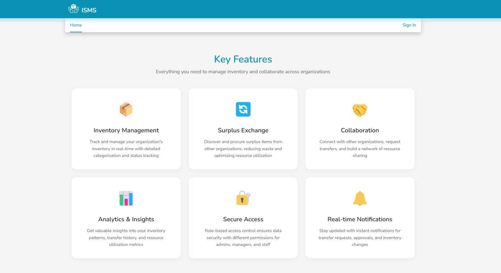
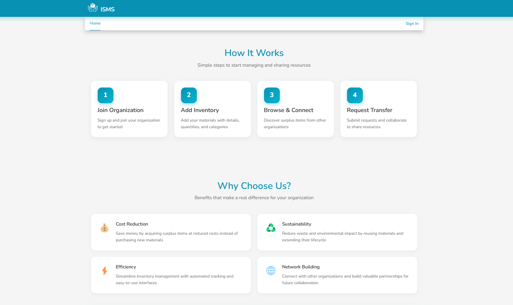
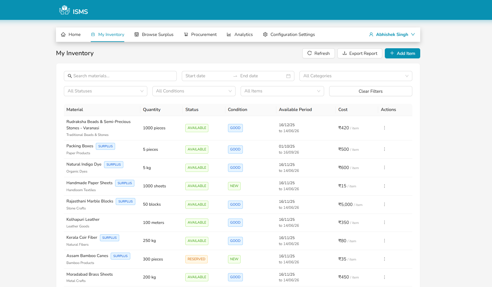
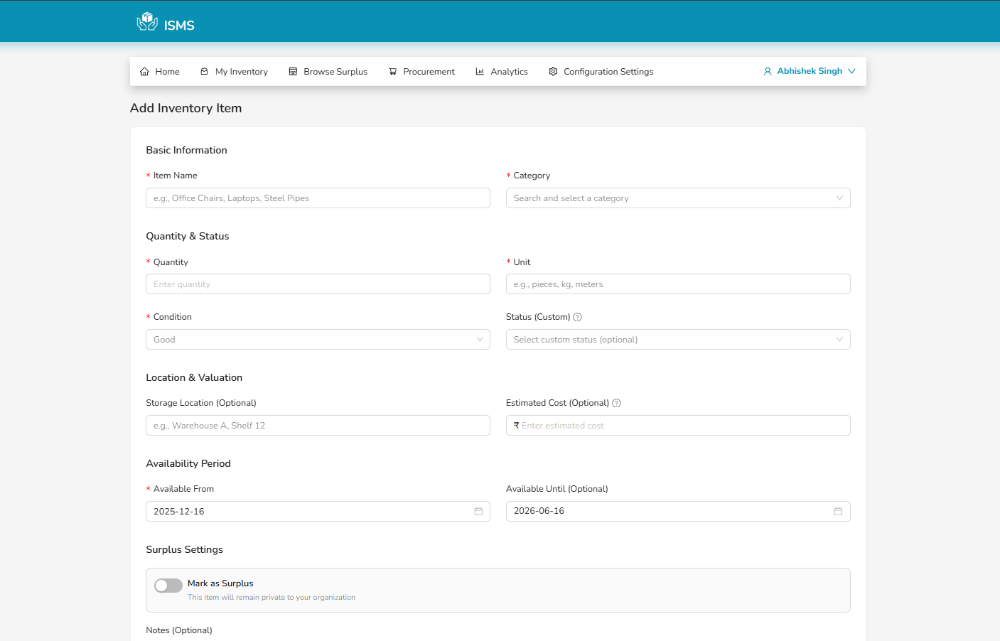
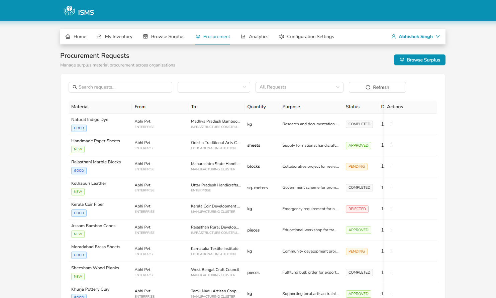
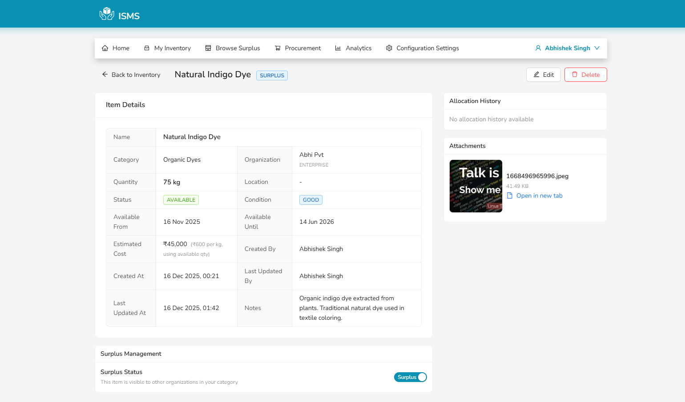
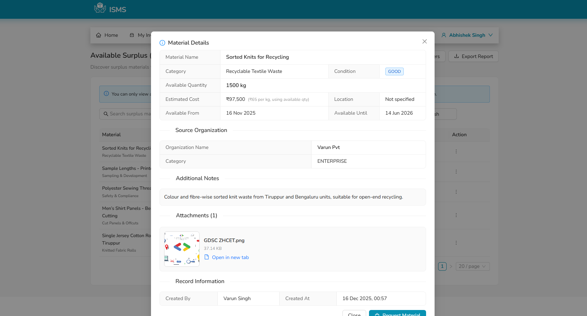
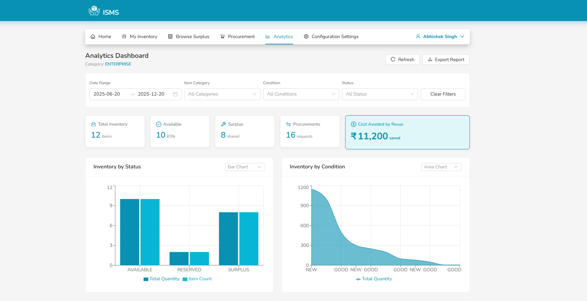
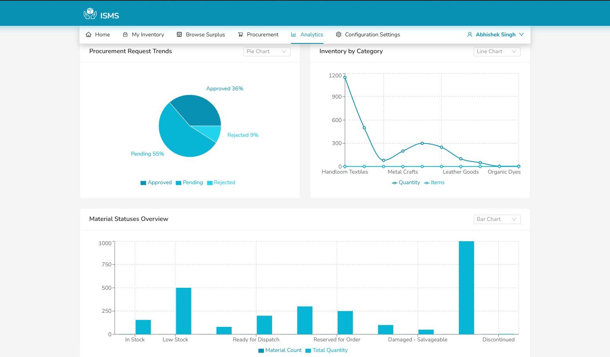
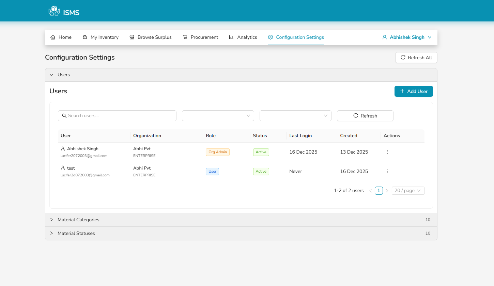
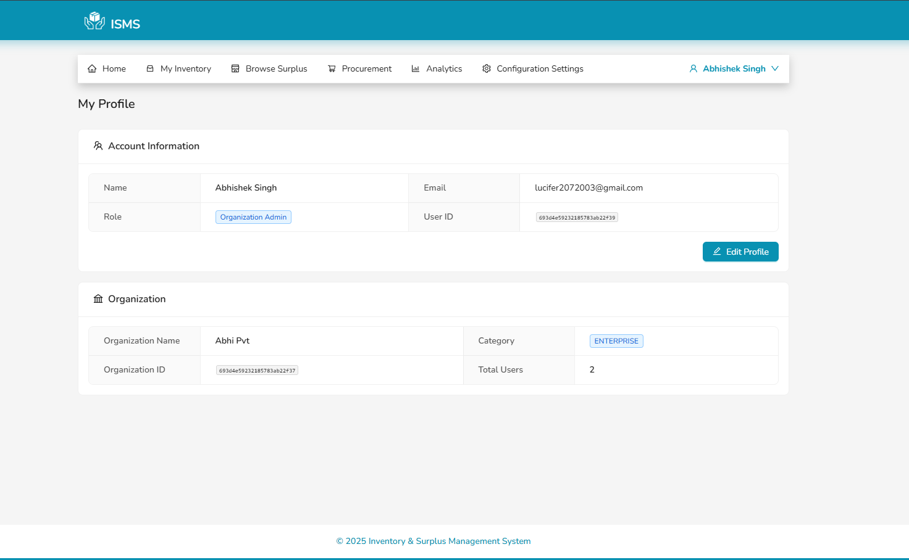
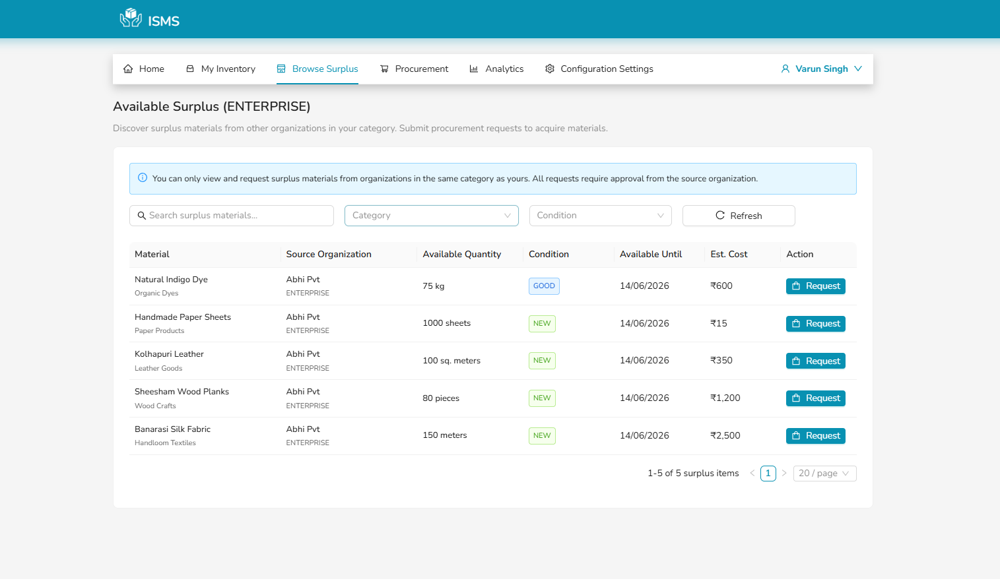
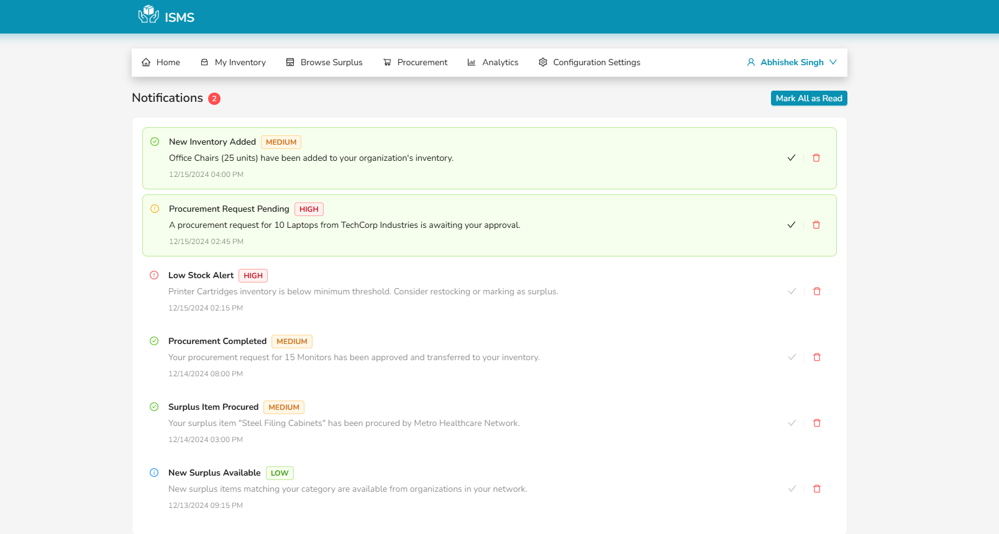
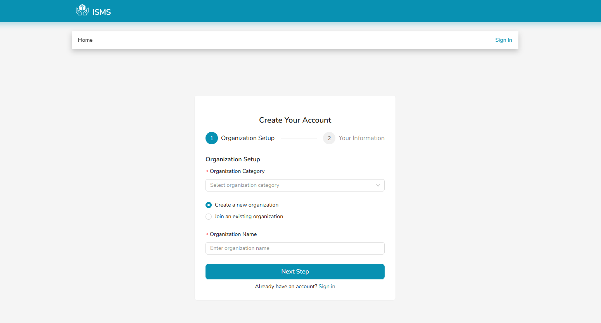
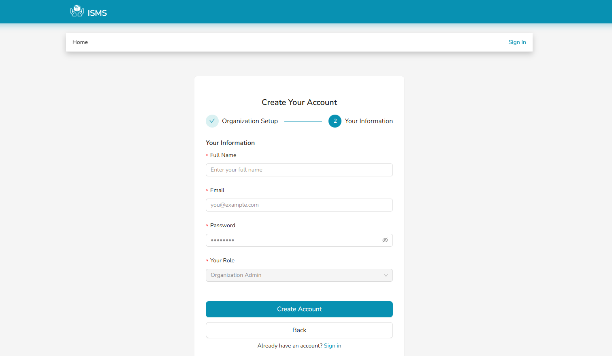
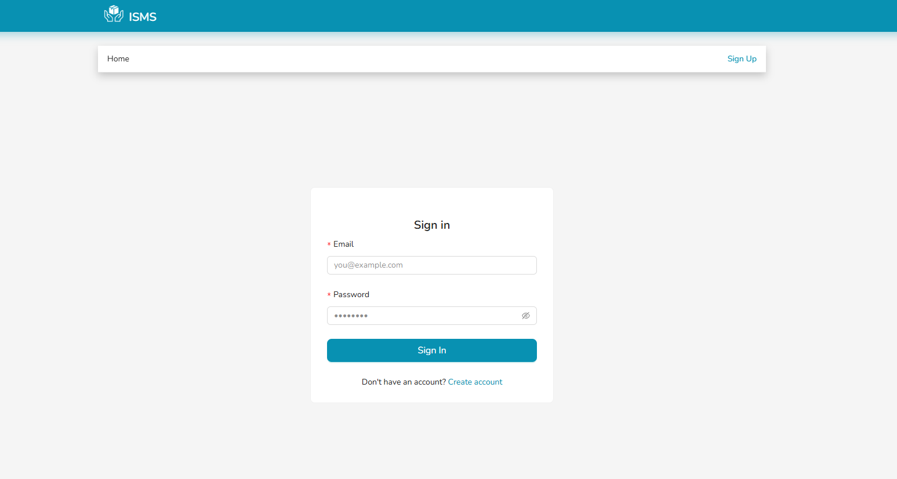

---

## 11. Deployment

### 11.1 Backend Deployment (Railway)

Steps to deploy the backend API on **Railway**:

1. Push this repository to a public GitHub repo.
2. In Railway, create a new **Service** from the `backend/` directory of this repo.
3. Set environment variables from section **6.2** (ensure `NODE_ENV=production` and correct `MONGODB_URI` pointing to your production MongoDB instance).
4. Set build / start commands:
   - Build: `npm run build`
   - Start: `npm start`
5. After deployment, confirm the backend URL:
   - **Backend URL**: `https://sms-deploy-production.up.railway.app`

Update `frontend/src/lib/api.ts` (or environment variables) to point to the deployed backend base URL above.

### 11.2 Frontend Deployment (Netlify)

Steps to deploy the frontend on **Netlify**:

1. Connect the GitHub repo to Netlify and select the `frontend/` folder as the project root.
2. Use the build command:
   - `npm run build`
3. Set environment variables if needed (for example `VITE_API_URL` with the Railway backend URL).
4. After deployment, confirm the frontend URL:
   - **Frontend URL**: `https://isms-app.netlify.app`

### 11.3 Final Deployed URLs

- **Frontend (Netlify)**: `https://isms-app.netlify.app`
- **Backend (Railway)**: `https://sms-deploy-production.up.railway.app`
